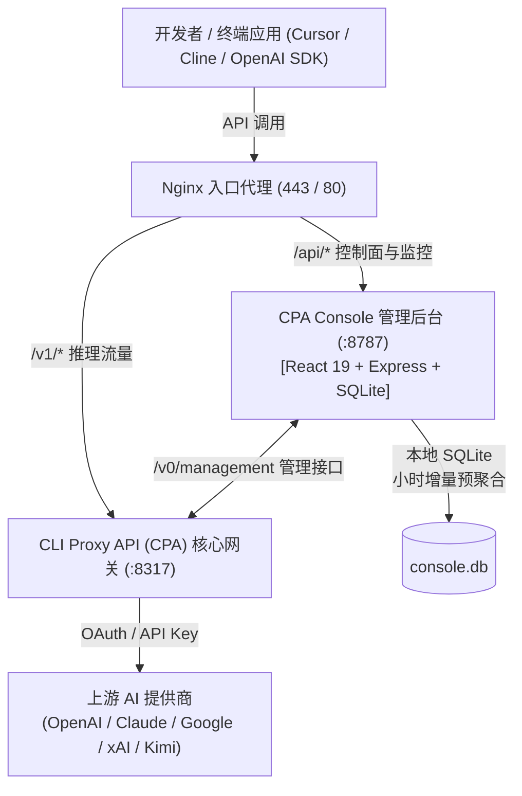

# CPA Console (CLI Proxy API Management Console)

[](https://opensource.org/licenses/MIT)
[](https://nodejs.org/)

**CPA Console** 是一个专为 **CLI Proxy API (CPA)** 生态打造的企业级统一 AI 网关管理控制台与全链路用量监控平台。基于 React 19 + TypeScript + Express + SQLite 构建，提供极低运行时开销、毫秒级报表查询以及生产级安全隔离能力。

---

## 🌟 核心特性

### 1. 🔑 API Key 多租户与细粒度配额控制
- **多维度消费限额**：支持总额度（Total）、每日额度（Daily）、每周额度（Weekly）独立设置与实时熔断，支持超额自动拦截。
- **并发调度策略**：支持全局并发限制与分组并发约束，支持零并发不限流特权分流配置。
- **安全密钥分发**：生产环境中密钥采用 SHA-256 哈希索引存储，支持基于一次性 60 秒限时防泄露复制令牌（Reveal Token）导出，杜绝前端源码或普通查询泄露明文。

### 2. 🔐 CPA 账号授权登录（OAuth & Device Code 登录池）
- **官方 OAuth 原生对接**：支持在管理后台直接发起主流提供商账号授权登录，凭证直接写入网关安全接管：
  - **OpenAI Codex**（ChatGPT / Codex 官方授权）
  - **Claude / Anthropic**（Claude Pro / Team / Enterprise 账号授权）
  - **Google Antigravity**（Google 账号 / Gemini 渠道接入）
  - **Moonshot Kimi**（Device Code 授权流）
  - **xAI Grok**（Device Code 授权流）
  - **Cognition Devin**（Devin CLI / Web 授权）
  - **Meta AI**（Meta Device 授权）
- **自动化轮询与容错回调**：后台每 2 秒实时探测浏览器授权确认状态，并支持无头网络环境下手动粘贴 Callback URL 完成闭环。

### 3. 📊 系统版本与运行健康双重监控
- **CPA 网关核心监控**：实时获取 CPA Gateway 运行版本（Version）、Git Commit、构建时间戳（Build Date）。
- **上游版本发现**：自动比对上游最新 Release 版本，发现新版本时在侧边栏与顶栏提供高亮升级提醒。
- **Console 管理端版本追溯**：展示管理后台当前构建版本、Release ID 及部署时间戳，方便 DevOps 运维核对。

### 4. 🔀 渠道编排与模型路由
- **渠道细粒度管控**：OpenAI 兼容渠道一键探测发现、动态启用/停用与配置回收。
- **模型矩阵治理**：逐模型开关控制，清晰标明多渠道同名模型的轮询权重与上游出口冲突。
- **出口代理隔离**：为每个账号独立配置 HTTP / HTTPS / SOCKS5 代理出口，或继承网关全局代理。

### 5. ⚡ 毫秒级性能与 Prompt Caching 分析
- **增量预聚合引擎**：基于 SQLite 小时级聚合表 `usage_hourly_rollup`，千万级调用日志场景下 90 天所有趋势与明细报表均在 1~30ms 内完成响应。
- **Prompt Caching 命中分析**：精准区分 Anthropic 缓存创建（Cache Write，1.25x 计费）与读取（Cache Read，0.1x 计费），实时还原 Token 成本与省钱比例。
- **实时调用流**：通过 SSE 长连接提供毫秒级请求水流，支持按模型、客户端与 API Key 实时探查。

### 6. 💳 账号额度与 Banked Reset 管理
- 集中可视化监控所有已接入 OAuth 账号的 5 小时限额、7 天周期额度。
- 支持 Claude Banked Reset（重置卡）与 Codex Reset Credits 的额度查询与一键认领。

---

## 🏗️ 架构拓扑



---

## 🚀 快速开始

### 1. 环境要求
- **Node.js**: `>= 24.0.0 < 25.0.0`
- **npm**: `>= 10.0.0`
- **CLI Proxy API (CPA)**: `>= 7.2.140`（推荐 7.3.15+）

### 2. 安装依赖
```bash
git clone git@g.ktvsky.com:ai-native/cpa-console.git
cd cpa-console
npm install
```

### 3. 环境配置
复制 `.env.example` 为 `.env` 并填写相关凭据：
```bash
cp .env.example .env
```
关键环境变量：
| 变量名 | 说明 | 示例 |
|---|---|---|
| `PORT` | 控制台服务监听端口 | `8787` |
| `CONSOLE_USERNAME` | 管理员登录账号 | `admin` |
| `CONSOLE_PASSWORD` | 管理员登录密码 | `your-secure-password` |
| `SESSION_SECRET` | Cookie 会话签名密钥 | `random-32-chars-string` |
| `CPA_BASE_URL` | CPA 核心网关地址 | `http://127.0.0.1:8317` |
| `CPA_MANAGEMENT_KEY` | CPA 管理密钥 | `your-cpa-mgmt-key` |
| `DATA_DIR` | SQLite 数据库存储目录 | `./data` |
| `USAGE_RETENTION_DAYS` | 用量明细保留天数 | `90` |
| `PROXY_PRESETS` | 可选出口代理预设列表 | `专线=http://127.0.0.1:7890;海外=http://proxy.example.com:8080` |

### 4. 开发与构建

```bash
# 启动本地开发（前端热重载 + 后端 tsx watch）
npm run dev

# 仅编译前端静态资源
npx vite build

# 运行自动化单元测试
npm test

# 执行完整验证（类型检查 + Lint + 测试）
npm run verify
```

---

## 🚢 生产部署

生产推荐使用 systemd 服务守护运行，并通过不可变 Release 软链机制发布。

### Magpie 内核接入

保留 Crosery API Console，使用 Magpie 内核处理协议转换和上游转发，不使用 Magpie 界面。
本地部署、鉴权与用量衔接、迁移待办和回退命令见
[deploy/magpie/CONSOLE-KERNEL.md](deploy/magpie/CONSOLE-KERNEL.md)。
默认仍为 CPA 模式，尚未切换生产流量或迁移生产 OAuth 与历史用量。
该方案仅用于本机验证，不替换生产 CPA、数据库或真实 Agent 配置。

### 部署脚本示例（Systemd 单元）
```ini
[Unit]
Description=CPA Console Management Service
After=network-online.target cli-proxy-api.service
Wants=network-online.target

[Service]
Type=simple
User=root
WorkingDirectory=/opt/cpa-console-current
EnvironmentFile=/opt/cpa-console/.env
Environment=NODE_ENV=production
ExecStart=/usr/bin/npm run start
Restart=on-failure
RestartSec=5s
LimitNOFILE=65536

[Install]
WantedBy=multi-user.target
```

---

## 📄 开源许可证

本项目采用 [MIT License](LICENSE) 授权开源。欢迎提出 Issue 与 Pull Request！
