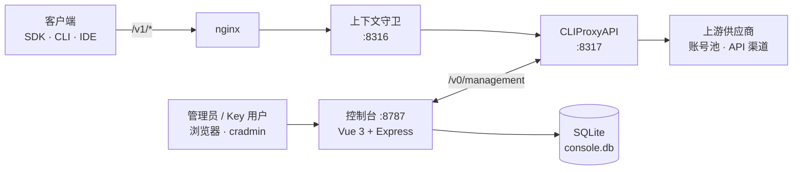

<!-- markdownlint-disable MD013 MD033 MD041 -->
<p align="center">
  
</p>

<h1 align="center">Crosery Nexus</h1>

<p align="center">
  给 <a href="https://github.com/router-for-me/CLIProxyAPI">CLIProxyAPI</a> 配的管理控制台：在一个地方管理 API Key、订阅账号、兼容渠道、模型和用量。
</p>

<p align="center">
  <a href="LICENSE"></a>
  
  
  
</p>

<p align="center">
  <a href="#功能">功能</a> ·
  <a href="#架构">架构</a> ·
  <a href="#快速开始">快速开始</a> ·
  <a href="#配置">配置</a> ·
  <a href="#管理-cli">管理 CLI</a> ·
  <a href="#发布与部署">发布与部署</a>
</p>

---

CLIProxyAPI（下文简称 CPA）负责协议转换和上游转发，本项目负责它之上的管理工作。控制台界面标题为 Crosery API Console。

## 它解决什么问题

- **给每个使用者发独立的 Key**：限定能用哪些模型和渠道、每天或每周能花多少钱、最多几个并发。
- **订阅账号和 API 渠道放在一起管**：Codex、Claude 等订阅账号与 OpenAI 兼容渠道在同一个「供应商」页里，看得到每个账号还剩多少额度。
- **每次请求都有账可查**：谁、用了哪个模型、花了多少钱、缓存命中多少、慢在哪里。
- **Key 持有者可以自助**：用自己的 Key 登录，查看用量、可用模型和接入方式，不必找管理员。

## 功能

### Key 与额度

- 创建、启停、轮换、删除 Key；按分组限定 Key 可用的模型与渠道。
- 总额度、日额度、周额度（美元）分别设置；超额后自动停用该 Key，窗口滚动或手动重置后自动恢复。
- 总并发与分组并发限制。
- 查看或复制完整 Key 需要先换取 60 秒内有效的一次性令牌。

> Key 级模型与渠道白名单由网关执行，需要使用 [`deploy/kernels/cpa-patches/`](deploy/kernels/cpa-patches/) 中补丁构建的 CPA（当前基于上游 v8.0.13）。网关不支持时，控制台会明确提示这层限制没有生效。

### 供应商

| 类型 | 说明 |
| --- | --- |
| 订阅账号 | 浏览器 OAuth 或 Device Code 授权：Codex、Claude、Antigravity、Kimi（国内站 / 国际站）、Grok、Devin、Meta AI。无法自动回调时可手动粘贴回调地址。也可以批量上传 `.json` / `.zip` 凭据文件。 |
| API 渠道 | 支持 OpenAI、Claude、OpenAI Responses 三种协议；从上游探测渠道模型，逐个模型开关；按成功率和 p95 延迟展示渠道健康。 |
| 全局共享模型 | 默认对所有 Key 开放的模型列表。 |
| 账号额度 | 展示 Codex、Claude、Antigravity 账号的额度窗口；支持兑现 Codex 重置次数与 Claude banked reset。 |
| 出口代理 | 每个账号可单独指定代理、强制直连或继承全局设置；代理池可导入订阅链接、Clash 配置和分享链接，由控制台托管的 mihomo 进程提供本地出口，并做连通性检测。 |

### 模型

- 汇总所有渠道与账号提供的模型，标出同名模型的多个来源，可以逐个来源开关。
- 按输出类型分类（对话、图像、视频、音频、向量、重排）。
- 显示每个模型的计价来源，标出尚未定价的模型。

### 用量

- 四个页签：**总览**、**请求**明细、**缓存**、**性能**（延迟与首字时间）。
- 每条请求在入库时按内置价格表计价，区分缓存读取与缓存写入。
- 实时请求流（SSE），延迟约 1–2 秒。
- 报表读取小时级预聚合表，并在后台线程里查询，不阻塞主服务。

### Key 用户自助

- 用 API Key 登录后进入 `/me`：概览、用量、可用模型、接入说明。
- `GET /v1/usage` 按请求头里的 Key 返回它自己的用量，不包含任何管理字段。
- `/docs` 是独立的接入文档页。

### 运维

- 同步中心：查看模型发现、价格元数据、账号额度等后台任务的状态，并可手动触发。
- 版本信息、审计日志。
- 管理员 CLI `cradmin`，见[管理 CLI](#管理-cli)。

## 架构



- **推理流量不经过控制台**：客户端请求经 nginx 和上下文守卫直达 CPA。上下文守卫是单独部署的组件，不在本仓库，控制台不依赖它。
- 控制台通过 CPA 管理接口 `/v0/management` 工作：每秒取一次用量队列写入 SQLite，每 15 秒把 Key、模型白名单和额度状态与网关对账一次。
- 数据存放在 `DATA_DIR/console.db`（Node 内置 `node:sqlite`）。

## 快速开始

### 环境要求

- Node.js 24（`>=24 <25`）和 npm
- 一个已开启管理接口的 CPA 实例，以及它的管理密钥

### 安装与配置

```bash
git clone https://github.com/Crosery/crosery-nexus.git
cd crosery-nexus
npm install
cp .env.example .env   # 至少填写 CONSOLE_PASSWORD、SESSION_SECRET、CPA_MANAGEMENT_KEY
```

### 运行

服务端不会自动读取 `.env`，启动前先把它导出到环境变量：

```bash
npm run build
set -a; . ./.env; set +a
npm start              # http://127.0.0.1:8787，用户名默认 admin
```

### 本地开发

Vite 开发服务器在 `5173` 端口，并把 `/api` 代理到 `127.0.0.1:8791`，所以开发时让服务端监听 8791：

```bash
set -a; . ./.env; set +a
PORT=8791 npm run dev  # 前端热更新 + 服务端 tsx watch，打开 http://127.0.0.1:5173
```

常用检查：

```bash
npm test               # 服务端、CLI 与脚本的单元测试（node --test）
npm run lint           # oxlint
npm run build          # TypeScript 检查 + 前端构建
```

## 配置

完整示例见 [`.env.example`](.env.example)。常用变量：

| 变量 | 默认值 | 说明 |
| --- | --- | --- |
| `HOST` / `PORT` | `127.0.0.1` / `8787` | 控制台监听地址 |
| `CONSOLE_USERNAME` | `admin` | 管理员用户名 |
| `CONSOLE_PASSWORD` | 无，必填 | 管理员密码；也可用 `CONSOLE_PASSWORD_FILE` 指向仅属主可读写的文件 |
| `SESSION_SECRET` | 无，必填 | 会话签名密钥；也可用 `SESSION_SECRET_FILE` |
| `CPA_BASE_URL` | `http://127.0.0.1:8317` | CPA 地址 |
| `CPA_MANAGEMENT_KEY` | 无，必填 | CPA 管理密钥 |
| `PUBLIC_GATEWAY_BASE_URL` | 空 | Key 用户「接入」页显示的公网网关地址；为空时显示本机网关地址 |
| `DATA_DIR` | `./data` | SQLite 与运行时文件目录 |
| `USAGE_RETENTION_DAYS` | `90` | 请求明细保留天数 |
| `USAGE_COLLECT_INTERVAL_MS` | `1000` | 从 CPA 取用量的间隔 |
| `SYNC_INTERVAL_MS` | `15000` | Key、白名单与额度的对账间隔 |
| `COOKIE_SECURE` | `true` | 本地用 HTTP 调试时设为 `false` |
| `PROXY_PRESETS` | 空 | 账号出口代理候选，格式 `标签=地址`，多条用分号分隔 |
| `MIHOMO_BIN` | 空 | 代理池使用的 mihomo 可执行文件（≥ 1.19）；为空时在 `PATH` 上查找 `mihomo` / `clash-meta` |
| `GATEWAY_ENGINE` | `cpa` | 网关内核；`magpie` 为实验选项，见 [`deploy/magpie/CONSOLE-KERNEL.md`](deploy/magpie/CONSOLE-KERNEL.md) |

其余变量（额度查询缓存、凭据上传限制、nginx 不限速同步等）见 [`server/config.ts`](server/config.ts)。不要把任何密钥写进仓库。

## 管理 CLI

`cradmin` 是管理员命令行，代码在 [`cli/`](cli/)，只用 Node 内置模块。它只调用控制台的 HTTP API，与网页共用同一套校验和审计；写操作会按影响大小要求确认，所有写命令都支持 `--dry-run`。

```bash
node cli/cradmin.mjs                                  # 交互菜单
node cli/cradmin.mjs status                           # 总览
node cli/cradmin.mjs keys create --name demo --groups codex --daily-usd 5
node cli/cradmin.mjs config export --out crosery.json # 导出配置（不含任何密钥）
node cli/cradmin.mjs config apply crosery.json --dry-run
```

安装方式、凭据来源和完整命令见 [`docs/cli.md`](docs/cli.md)。

## 发布与部署

不使用 CI/CD：在本机从干净的工作树构建，直接部署到目标机。

- 两条长期分支：`stage` 对应预发布，`main` 对应正式。
- 在 `stage` 的某个提交上打 `vX.Y.Z-rc.N`，部署到预发布环境；验收通过后，给**同一个提交**打 `vX.Y.Z`，部署到正式环境。
- 每个环境的非敏感配置放在 `deploy/env/<env>.env`；发布目标写在本机不入库的 `deploy/env/<env>.release.local`；密钥只保存在目标机上。
- 构建要求 Node 24。

```bash
node scripts/release.mjs plan     preview    v1.2.0-rc.1
node scripts/release.mjs deploy   preview    v1.2.0-rc.1
RELEASE_ACCEPT_KEY=… node scripts/release.mjs accept preview
node scripts/release.mjs plan     production v1.2.0
node scripts/release.mjs deploy   production v1.2.0
node scripts/release.mjs status   production
node scripts/release.mjs rollback production
```

| 子命令 | 作用 |
| --- | --- |
| `plan <env> <tag>` | 只跑门禁，列出部署计划 |
| `deploy <env> <tag>` | 构建、上传、切换、健康检查；不健康自动切回 |
| `accept <env>` | 验收控制台与网关（JSON、SSE、工具往返），结果记入目标机 |
| `status <env>` | 查看环境当前运行的版本与最近记录 |
| `rollback <env>` | 回滚到上一个版本 |

完整规则见 [`docs/ops/release.md`](docs/ops/release.md)。服务以 systemd 运行，单元在 [`deploy/systemd/`](deploy/systemd/)，nginx 片段在 [`deploy/nginx/`](deploy/nginx/)。

## 目录结构

| 路径 | 内容 |
| --- | --- |
| `src/` | 前端：Vue 3 + Tuffex + UnoCSS，管理员与 Key 用户两套页面 |
| `server/` | 后端：Express 5，CPA 管理接口客户端、用量采集与报表、SQLite |
| `cli/` | 管理员 CLI `cradmin` |
| `packages/contracts/` | 前后端共享的数据契约 |
| `scripts/` | 构建、价格表、QA 与运维脚本 |
| `deploy/` | nginx 片段、systemd 单元、CPA 补丁与构建脚本 |
| `docs/` | 文档与 README 素材 |
| `public/` | 图标与供应商 logo |

## 许可证

[MIT](LICENSE)
